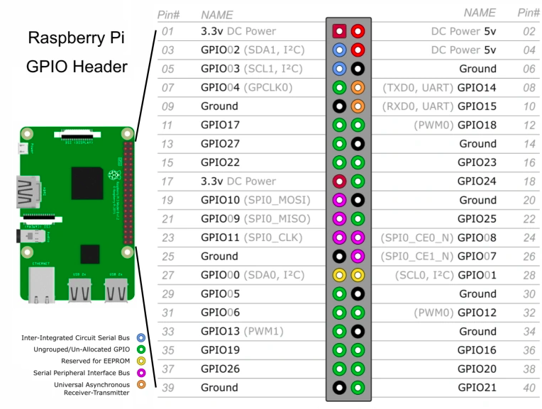

# Karae

## Installation  

Python  
```sh
sudo pip install -r requirements.txt
```
Il est possible qu'il manque des packages apt et des libs python.  
Regarder les erreurs et installer les packages signaler comme manquant.  

Puck  
```sh
cd ./puck && npm install
```

## Branchements

### Button

- **\+** --> Alimentation 3.3V
- **S** --> GPIO 15

### Temperature/Humidity

- **\+** --> 3.3V
- **\-** --> GROUND
- **S** --> GPIO 14

### Humidity Ground (Boolean)

- **\+** --> 5V
- **\-** --> GROUND (en face GPIO 21)
- **DO** --> GPIO 20

### Volume

- **\+** --> 3.3V (Breadboard)
- **\-** --> GROUND (Breadboard)
- **CLK** --> GPIO 17
- **DT** --> GPIO 18

### Proximity

- **\+** --> 5V
- **\-** --> GROUND 
- **S** --> GPIO 23  

### Buttons

- **\+** --> 3.3V

- **S** :
    - Left : GPIO 12
    - Ok : GPIO 21
    - Reft : GPIO 19

